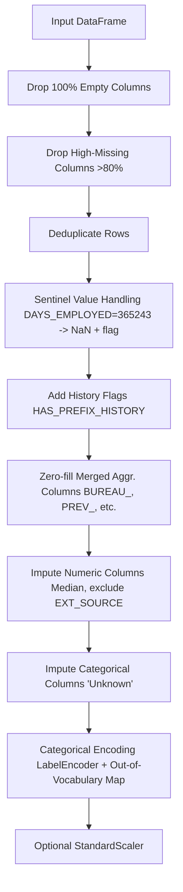

# 🏦 TrustFin Bank – Loan Default Risk Analysis

A production-grade ML system that predicts loan default risk using customer financial behaviour, repayment history, credit information, employment stability, and regional economic factors.

---

## Problem Statement

TrustFin Bank has observed a rise in loan defaults, particularly among new borrowers. The risk management team needs a data-driven system that can proactively identify high-risk applicants before a loan is approved, enabling targeted intervention.

## Business Objective

Build a reliable binary classifier that predicts whether a customer will default on their loan (`TARGET = 1`) or repay it (`TARGET = 0`), and surface interpretable risk factors to support credit officer decisions.

**Primary metric**: ROC-AUC (robust to class imbalance)  
**Secondary metrics**: Precision, Recall, F1

---

## Architecture

```
┌──────────────────────────────────────────────────────────────┐
│                    DATA SOURCES                              │
│  Core Banking  │  Credit Bureau  │  App Form  │  Econ APIs  │
└───────┬──────────────┬─────────────────┬──────────┬─────────┘
        │              │                 │          │
        ▼              ▼                 ▼          ▼
┌──────────────────────────────────────────────────────────────┐
│               DATA LAYER  (data/)                            │
│  application_train.csv  bureau.csv  installments.csv  ...   │
└──────────────────────────┬───────────────────────────────────┘
                           │
                           ▼
┌──────────────────────────────────────────────────────────────┐
│           PREPROCESSING  (src/preprocessing.py)              │
│  • Sentinel value handling   • High-missing column drop      │
│  • Duplicate removal         • History-flag creation         │
│  • Median / zero imputation  • Label encoding                │
└──────────────────────────┬───────────────────────────────────┘
                           │
                           ▼
┌──────────────────────────────────────────────────────────────┐
│        FEATURE ENGINEERING  (src/feature_engineering.py)     │
│  Credit features  │  Repayment features  │  Financial feats  │
└──────────────────────────┬───────────────────────────────────┘
                           │
                           ▼
┌──────────────────────────────────────────────────────────────┐
│              TRAINING  (src/train.py)                        │
│  Logistic Regression  │  XGBoost  │  LightGBM               │
│  MLflow tracking → best model → models/                     │
└──────────────────────────┬───────────────────────────────────┘
                           │
              ┌────────────┴──────────────┐
              ▼                           ▼
┌─────────────────────────┐  ┌───────────────────────────────┐
│  EVALUATION             │  │  PREDICTION SERVICE           │
│  (src/evaluate.py)      │  │  (src/predict.py)             │
│  metrics.json           │  │  JSON risk output             │
│  plots → reports/       │  │  risk_level / probability     │
└─────────────────────────┘  └───────────────┬───────────────┘
                                             │
                                             ▼
                              ┌──────────────────────────────┐
                              │  STREAMLIT DASHBOARD         │
                              │  (app/streamlit_app.py)      │
                              │  Upload CSV · Risk scores    │
                              │  Portfolio summary · Factors │
                              └──────────────────────────────┘
```

---

## Project Directory & File Descriptions

Below is a detailed breakdown of all files and directories in the `Home-Credit-Default-Risk` repository, explaining their structural purpose and execution roles:

```
Home-Credit-Default-Risk/
├── data/                        # Data storage (ignored in Git except placeholders)
│   ├── final_df.csv.xls         # Main pre-merged dataset (bureau, payments, apps, credit)
│   └── processed_test.csv       # Saved stratified test set used for evaluation
├── notebooks/                   # Jupyter notebooks for prototyping and discovery
│   ├── eda.ipynb                # Exploratory Data Analysis & class imbalance checks
│   ├── featureEngineering.ipynb # Sandbox for deriving repayment behavior & debt metrics
│   └── modeling.ipynb           # Model prototyping, baselining, and hyperparameter checks
├── src/                         # Core Python modular ML pipelines
│   ├── preprocessing.py         # Data cleaning, outlier handling, and imputation
│   ├── feature_engineering.py   # Business logic and formula-based feature extraction
│   ├── train.py                 # Training orchestrator, model selection, MLflow tracker
│   ├── evaluate.py              # Offline validation, performance reports, and plot generators
│   └── predict.py               # Production risk scoring and decision-engine inference
├── models/                      # Production model artifacts and metadata
│   ├── model.pkl                # Serialized best-performing classifier (LightGBM)
│   ├── preprocessing.pkl        # Serialized PreprocessingPipeline object (encoders, medians)
│   ├── feature_list.pkl         # Serialized list of feature names to align datasets
│   └── model_meta.json          # Metric logs and properties of trained models
├── reports/                     # Model performance outputs and charts
│   ├── metrics.json             # Numeric classification performance (accuracy, precision, recall, F1, AUC)
│   ├── confusion_matrix.png     # Heatmap visualization of default vs. non-default predictions
│   ├── roc_curve.png            # ROC curve plot
│   └── feature_importance.png   # Bar chart showing the top 30 most predictive features
├── mlruns/                      # MLflow local runs directory (auto-created)
├── app/                         # Web applications
│   └── streamlit_app.py         # Streamlit-based interactive Loan Risk Dashboard
├── requirements.txt             # Python dependencies
├── dockerfile                   # Multi-stage Docker configuration file
└── README.md                    # Project documentation
```

### Module Descriptions

*   **[preprocessing.py](file:///Users/adi/project/Home-Credit-Default-Risk/src/preprocessing.py)**: Defines the [PreprocessingPipeline](file:///Users/adi/project/Home-Credit-Default-Risk/src/preprocessing.py#L270) class. It executes structured cleaning: drops empty and high-missing columns (>80%), removes duplicates, handles anomalies (replaces `365243` in employment days with `NaN` and flags it via `DAYS_EMPLOYED_ANOM`), creates database history flags, zero-fills aggregated metrics, imputes numerical values with their train medians (leaving `EXT_SOURCE` values blank for LightGBM/XGBoost to utilize missingness), imputes categoricals with `'Unknown'`, and applies `LabelEncoder`.
*   **[feature_engineering.py](file:///Users/adi/project/Home-Credit-Default-Risk/src/feature_engineering.py)**: Defines the [FeatureEngineer](file:///Users/adi/project/Home-Credit-Default-Risk/src/feature_engineering.py#L253) class. Processes credit bureau variables, repayment tracking, and applicant demographics to construct robust features.
*   **[train.py](file:///Users/adi/project/Home-Credit-Default-Risk/src/train.py)**: Resolves paths, merges all relational tables if `final_df.csv.xls` is missing, runs the preprocessing and feature engineering pipelines, splits dataset (80/20 train/test stratified), computes class weight adjustment ratios, runs cross-algorithm training (Logistic Regression baseline, XGBoost, LightGBM), tracks parameters/metrics in MLflow, finds the best model by test ROC-AUC, and persists serialized objects to `models/`.
*   **[evaluate.py](file:///Users/adi/project/Home-Credit-Default-Risk/src/evaluate.py)**: Computes macro/weighted precision, recall, F1-scores, accuracy, and ROC-AUC on the stratified test set using the serialized model. Produces confusion matrix heatmaps, ROC curves, and horizontal feature importance charts.
*   **[predict.py](file:///Users/adi/project/Home-Credit-Default-Risk/src/predict.py)**: Defines [LoanRiskPredictor](file:///Users/adi/project/Home-Credit-Default-Risk/src/predict.py#L82) to serve inference. Runs single-client dictionary predictions or batch CSV dataframe queries. Matches incoming payloads against the expected training schema, applies pre-fitted imputation and categorical label encoders, runs predictions, and tags results with risk levels (`LOW`, `MEDIUM`, `HIGH`), actionable recommendations, and identified risk factors.
*   **[streamlit_app.py](file:///Users/adi/project/Home-Credit-Default-Risk/app/streamlit_app.py)**: Main dashboard code. Incorporates page CSS, sidebar configuration, batch csv file uploads, risk distribution metrics, visual bar and probability density histograms, predictions datagrid views, and individual client deep-dives (gauge progress bar, factor bullet lists, and credit officer recommendations).

---

## Machine Learning Models in the System

TrustFin Bank evaluates three model architectures during training, implementing specific tuning and class-imbalance strategies:

### 1. Logistic Regression (Baseline)
*   **Definition/Pipeline**: Built using scikit-learn's `Pipeline` combining median imputation, standard scaling, and a `LogisticRegression` classifier.
*   **Imbalance Handling**: Configured with `class_weight="balanced"`.
*   **Parameters**: `solver="lbfgs"`, `max_iter=1000`, `random_state=42`.
*   **Evaluation (Test ROC-AUC)**: **`0.7646`**
*   **Use Case**: Lightweight, highly interpretable linear baseline.

### 2. XGBoost Classifier (Advanced Boosting)
*   **Definition/Pipeline**: Built using `XGBClassifier` utilizing histogram-based tree splitting.
*   **Imbalance Handling**: Uses a dynamic `scale_pos_weight` factor calculated from the training labels (approx. `11.5`), which scales the loss function gradient for positive samples (defaults).
*   **Parameters**: `n_estimators=500`, `learning_rate=0.05`, `max_depth=6`, `eval_metric="auc"`, `tree_method="hist"`, `random_state=42`.
*   **Evaluation (Test ROC-AUC)**: **`0.7779`**
*   **Use Case**: Non-linear tree boosting that captures complex interactions and natively supports missing values.

### 3. LightGBM Classifier (Production Champion)
*   **Definition/Pipeline**: Built using LightGBM's `LGBMClassifier`.
*   **Imbalance Handling**: Configured with `class_weight="balanced"`.
*   **Parameters**: `n_estimators=1000`, `learning_rate=0.05`, `num_leaves=31`, `random_state=42`.
*   **Evaluation (Test ROC-AUC)**: **`0.7786`** (Selected as the production champion saved to `models/model.pkl`).
*   **Use Case**: Fastest training speeds on large tabular data, highly resistant to overfitting, and delivers the highest discriminatory capability (ROC-AUC).

---

## Preprocessing Pipeline Details

The [PreprocessingPipeline](file:///Users/adi/project/Home-Credit-Default-Risk/src/preprocessing.py#L270) cleans the datasets systematically through the following stages:



---

## Feature Engineering Formulations

Features are computed dynamically within [feature_engineering.py](file:///Users/adi/project/Home-Credit-Default-Risk/src/feature_engineering.py) using the following mathematical formulations:

### 1. Credit Bureau Features
*   **Active Loan Ratio**:
    $$\text{CREDIT\_ACTIVE\_LOAN\_RATIO} = \frac{\text{BUREAU\_ACTIVE\_LOANS}}{\text{BUREAU\_LOAN\_COUNT}}$$
*   **Credit History Length**:
    $$\text{CREDIT\_HISTORY\_YEARS} = \frac{|\text{BUREAU\_AVG\_DAYS\_CREDIT}|}{365}$$
*   **Previous Default Flag**:
    $$\text{CREDIT\_DEFAULT\_FLAG} = \mathbb{I}(\text{BUREAU\_TOTAL\_OVERDUE} > 0)$$
*   **Credit Utilisation**:
    $$\text{CREDIT\_UTILISATION} = \text{clip}\left(\frac{\text{BUREAU\_TOTAL\_DEBT}}{\text{BUREAU\_AVG\_CREDIT\_AMT} \times \text{BUREAU\_LOAN\_COUNT}}, 0, 1\right)$$
*   **Composite Credit Risk Score**:
    $$\text{CREDIT\_RISK\_SCORE} = 0.3 \times \text{CREDIT\_ACTIVE\_LOAN\_RATIO} + 0.4 \times \text{CREDIT\_DEFAULT\_FLAG} + 0.3 \times \text{CREDIT\_UTILISATION}$$

### 2. Repayment Behaviour Features
*   **Late Payment Ratio**:
    $$\text{REPAY\_LATE\_PAYMENT\_RATIO} = \text{clip}\left(\frac{\text{INSTALL\_MISSED\_PAYMENTS}}{\text{INSTALL\_COUNT}}, 0, 1\right)$$
*   **Average Days Late**:
    $$\text{REPAY\_AVG\_DAYS\_LATE} = \text{clip}(\text{INSTALL\_AVG\_LATE\_DAYS}, 0, \infty)$$
*   **Payment Deficit Ratio**:
    $$\text{REPAY\_PAYMENT\_DEFICIT\_RATIO} = \mathbb{I}(\text{INSTALL\_AVG\_PAYMENT\_DIFF} > 0)$$
*   **Composite Repayment Behaviour Score**:
    $$\text{REPAY\_BEHAVIOUR\_SCORE} = \text{clip}\left(0.4 \times \text{REPAY\_LATE\_PAYMENT\_RATIO} + 0.4 \times \text{clip}\left(\frac{\text{REPAY\_AVG\_DAYS\_LATE}}{90}, 0, 1\right) + 0.2 \times \text{clip}\left(\frac{\text{POS\_AVG\_DPD}}{30}, 0, 1\right), 0, 1\right)$$

### 3. Financial Status Features
*   **Debt-to-Income Ratio**:
    $$\text{FIN\_DEBT\_TO\_INCOME} = \text{clip}\left(\frac{\text{AMT\_CREDIT}}{\text{AMT\_INCOME\_TOTAL} + 10^{-6}}, 0, 50\right)$$
*   **Annuity-to-Income Ratio**:
    $$\text{FIN\_ANNUITY\_TO\_INCOME} = \text{clip}\left(\frac{\text{AMT\_ANNUITY}}{\frac{\text{AMT\_INCOME\_TOTAL}}{12} + 10^{-6}}, 0, 5\right)$$
*   **Credit-to-Goods Price Ratio**:
    $$\text{FIN\_CREDIT\_TO\_GOODS} = \text{clip}\left(\frac{\text{AMT\_CREDIT}}{\text{AMT\_GOODS\_PRICE} + 10^{-6}}, 0, 5\right)$$
*   **Income Stability Score**:
    $$\text{FIN\_INCOME\_STABILITY\_SCORE} = 0.5 \times \text{clip}\left(\frac{|\text{DAYS\_EMPLOYED}|}{365 \times 20}, 0, 1\right) + 0.5 \times \text{percentile\_rank}(\text{AMT\_INCOME\_TOTAL})$$
*   **Financial Stress Index**:
    $$\text{FIN\_FINANCIAL\_STRESS\_INDEX} = 0.4 \times \text{clip}\left(\frac{\text{FIN\_DEBT\_TO\_INCOME}}{10}, 0, 1\right) + 0.3 \times \text{clip}\left(\frac{\text{FIN\_ANNUITY\_TO\_INCOME}}{2}, 0, 1\right) + 0.3 \times \text{REPAY\_BEHAVIOUR\_SCORE}$$

---

## Installation

### Prerequisites
*   Python 3.9+
*   Git

### Steps

```bash
# 1. Clone the repository
git clone https://github.com/Aditya3100/TrustFin-Default-Prediction.git
cd Home-Credit-Default-Risk

# 2. Create and activate a virtual environment
python -m venv venv
source venv/bin/activate        # Linux / macOS
venv\Scripts\activate           # Windows

# 3. Install dependencies
pip install -r requirements.txt

# 4. Download the data
# Place Home Credit CSV files in data/:
#   application_train.csv, bureau.csv, bureau_balance.csv,
#   previous_application.csv, POS_CASH_balance.csv,
#   installments_payments.csv, credit_card_balance.csv
# Dataset: https://www.kaggle.com/c/home-credit-default-risk/data
```

---

## Running Training

```bash
python src/train.py --data-dir data/ --models-dir models/
```

This execution command triggers the following workflow:
1. Loads raw source data (or checks for the aggregated cached `final_df.csv.xls` file).
2. Initializes the `PreprocessingPipeline` to clean raw and imputed features.
3. Computes engineered credit, repayment, and income-stability scores.
4. Executes train/test stratification.
5. Launches Logistic Regression, XGBoost, and LightGBM model training cycles.
6. Evaluates and registers model parameters and metrics to MLflow (`./mlruns`).
7. Selects the champion classifier and saves serialization files (`model.pkl`, `preprocessing.pkl`, `feature_list.pkl`, `model_meta.json`) to the specified models directory.

**Launch MLflow Experiment Tracker:**
```bash
mlflow ui
# Open http://127.0.0.1:5000 in your browser
```

---

## Running Evaluation

```bash
python src/evaluate.py \
  --models-dir models/ \
  --reports-dir reports/ \
  --data-path data/processed_test.csv
```

Outputs written to the `reports/` directory:
*   `metrics.json`: Final metrics comparison.
*   `confusion_matrix.png`: Heatmap distribution of predictions.
*   `roc_curve.png`: Performance validation curve.
*   `feature_importance.png`: Feature weight importance ranking.

---

## Running the Streamlit App

```bash
streamlit run app/streamlit_app.py
```

Access the user interface locally at `http://localhost:8501`.

### Analyst Features
*   **Batch Scoring**: Upload a custom CSV table containing client data to run parallel predictions.
*   **Portfolio Distribution**: Visualizes portfolio metrics (Total client count, percentage of High/Medium/Low risk clients, average delinquency probability, and distributions).
*   **Interactive Drill-Down**: Query specific clients to visualize their predicted defaults, risk factors (e.g., poor credit utilisation, high debt), and standard bank recommendations.

---

## Running Predictions Programmatically

```python
from src.predict import LoanRiskPredictor

# Initialize the predictor using the serialized models directory and confidence threshold
predictor = LoanRiskPredictor(models_dir="models/", threshold=0.5)

# scoring query
result = predictor.predict_single({
    "AMT_CREDIT": 500000,
    "AMT_INCOME_TOTAL": 150000,
    "AMT_ANNUITY": 25000,
    "DAYS_EMPLOYED": -1200,
    "BUREAU_TOTAL_DEBT": 350000,
    "BUREAU_AVG_CREDIT_AMT": 400000,
    "BUREAU_LOAN_COUNT": 3,
    "BUREAU_ACTIVE_LOANS": 1,
    "INSTALL_MISSED_PAYMENTS": 1,
    "INSTALL_COUNT": 12,
    "INSTALL_AVG_LATE_DAYS": 4.5,
    "EXT_SOURCE_2": 0.45,
    "EXT_SOURCE_3": 0.32
})

print(json.dumps(result, indent=2))
# Output:
# {
#   "risk_level": "MEDIUM",
#   "default_probability": 0.4285,
#   "recommendation": [
#     "Consider reducing loan amount by 20–30 %",
#     "Request additional income verification",
#     "Apply standard interest rate with quarterly review"
#   ],
#   "risk_factors": [
#     "Low external credit score (source 3)"
#   ]
# }
```

---

## Docker Deployment

```bash
# Build the production container image
docker build -t trustfin-risk .

# Run the Streamlit web server
docker run -p 8501:8501 trustfin-risk

# Mount volumes and execute model training inside Docker
docker run -v $(pwd)/data:/app/data -v $(pwd)/models:/app/models \
  trustfin-risk python src/train.py
```

---

## Future Improvements

*   **SHAP Explanations**: Integrate SHAP values directly inside the Streamlit deep-dive page to provide local feature contribution visualization, satisfying credit compliance adverse-action requirements.
*   **Threshold Optimization**: Determine the optimal decision boundary using cost-benefit matrix analysis (cost of false negatives vs. cost of false positives) instead of a fixed 0.5 cut-off.
*   **API Framework**: Port predictions from a Python class to a FastAPI service with async endpoints and Redis caching.
*   **Model Drift Monitoring**: Set up Evidently AI tracking to detect feature and target drift.

---

## Dataset

Home Credit Default Risk – [Kaggle Competition](https://www.kaggle.com/c/home-credit-default-risk)

## License

For educational and portfolio use. All data is sourced from the public Kaggle competition.